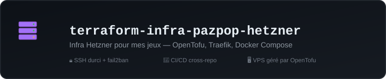

# terraform-infra-pazpop-hetzner

Infra du VPS Hetzner qui héberge [ArcadePipe](https://github.com/pazpop/arcadepipe) (et, à terme, d'autres jeux). Gérée avec [OpenTofu](https://opentofu.org/) (fork open source de Terraform, même langage HCL).

## 🎓 Contexte

Réalisé avec l'aide de [Claude](https://claude.com) pour explorer et accélérer, pas pour décider : je teste avant de faire confiance et je reste le décideur à chaque étape.

## Stack

| Composant | Techno | Rôle |
|---|---|---|
| Cloud | [Hetzner Cloud](https://www.hetzner.com/cloud/) | VPS `cx23`, IP primaire, firewall |
| Provisioning | cloud-init | Installe Docker et durcit SSH au premier boot |
| Reverse proxy | [Traefik](https://traefik.io/) (`docker/traefik/`) | Ports 80/443, TLS automatique (Let's Encrypt), routage par labels Docker |
| Portail | Page statique auto-générée (`docker/portal/`) | `game.pazpop.net` liste les jeux déployés, à partir des labels `pazpop.portal.*` |
| Jeux | `docker/arcadepipe/` | Routage Traefik et limites de ressources ; le code du jeu vit dans son propre repo |
| État Terraform | Local (gitignoré) | Un seul opérateur, une seule VPS |

```
terraform/   # ce que gère tofu : VPS, firewall, clé SSH, IP, cloud-init
docker/      # traefik/, portal/, arcadepipe/ : déployés en docker-compose, pas via tofu
backup/      # backup quotidien de la DB SQLite (timer systemd)
deploy.sh    # déploie une stack (traefik, portal ou arcadepipe) sur le VPS
```

## Utilisation

Prérequis : [OpenTofu](https://opentofu.org/docs/intro/install/), un [token API Hetzner](https://console.hetzner.cloud/) (Read & Write), une paire de clés SSH dédiée.

```sh
cd terraform
cp terraform.tfvars.example terraform.tfvars   # renseigner hcloud_token + ssh_source_cidrs
tofu init && tofu plan && tofu apply
```

`terraform.tfvars` est gitignoré (il contient le token). Le token peut aussi venir de `HCLOUD_TOKEN`, **mais jamais des deux à la fois** : `terraform.tfvars` prime silencieusement, et une rotation faite via la variable d'environnement laisserait l'ancien token utilisé, avec des 401 déroutants.

Ensuite, depuis la racine : `./deploy.sh traefik`, puis `./deploy.sh portal`, puis `./deploy.sh arcadepipe`. Chaque jeu rejoint le réseau `traefik-public` et pose ses labels `pazpop.portal.*` pour apparaître sur le portail. `tofu output ssh_command` donne la commande SSH prête à l'emploi.

## Aller plus loin

- [Déploiement automatique d'ArcadePipe](docs/ci-cd.md) : comment les deux CI se parlent, secrets à poser
- [Sécurité](docs/securite.md) : durcissement du VPS, CSP, rate-limit, limites de requête
- [Backups](backup/README.md) · [Traefik](docker/traefik/README.md) · [Portail](docker/portal/README.md)

## Roadmap

- [ ] Alertes (webhook Discord/Slack) sur les bans fail2ban, les arrêts de service et les échecs de backup : aujourd'hui, tout est à vérifier à la main (`fail2ban-client status sshd`, `docker compose ps`).
- [ ] Backups : copie distante (aujourd'hui uniquement locaux). Le point d'extension est prévu dans `backup-arcadepipe-db.sh` (`BACKUP_DEST`).
- [ ] Durcir la CSP : `'wasm-unsafe-eval'` à la place de `'unsafe-eval'` (le lecteur de musique d'arcadepipe est en WebAssembly). À tester sur Chromium et Firefox avant d'appliquer : l'AudioWorklet hérite de la CSP de la page.
- [ ] Scan de vulnérabilités des images Docker (Trivy) dans le CI d'ArcadePipe.
- [ ] Décision Traefik ou Caddy à reposer quand un 2e jeu se précise (voir la ROADMAP d'arcadepipe).

## Choix délibérés

- **Pas de backend d'état distant** (S3/GCS) : un seul opérateur, une seule VPS, l'enjeu d'un état local perdu est faible. À reconsidérer si plusieurs personnes ou machines doivent appliquer les mêmes changements.
- **Traefik hors Terraform** : c'est une stack Docker Compose applicative, déployée à la main comme les jeux qu'elle route.

## Licence

[MIT](LICENSE).
