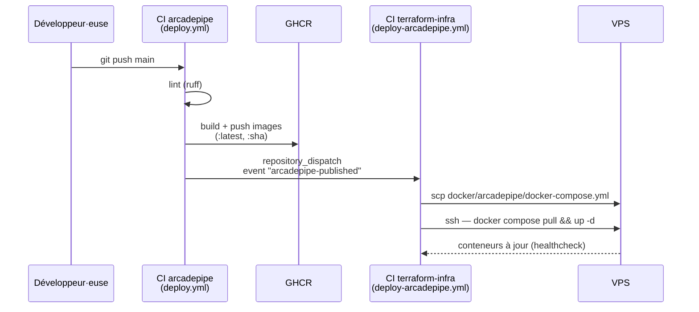

# terraform-infra-pazpop-hetzner

Infra du VPS Hetzner qui héberge [ArcadePipe](https://github.com/pazpop/arcadepipe) (et, à terme, d'autres jeux du même genre). Gérée avec [OpenTofu](https://opentofu.org/) plutôt que Terraform (fork open-source, même langage HCL, aucune dépendance à HashiCorp).

## 🎓 Contexte

Ce projet est réalisé avec l'aide de [Claude](https://claude.com) (Anthropic) comme assistant technique. L'objectif n'est pas de contourner l'apprentissage, mais de l'accélérer : explorer des choix que je n'aurais pas eu le temps de creuser seul, challenger mes propres habitudes, et accélérer les tâches répétitives. Je reste le décideur à chaque étape — je teste avant de faire confiance, je demande des revues de sécurité et de qualité, et j'écarte ce qui est disproportionné pour un projet de cette taille (voir *Sécurité* et *Choix délibérés* ci-dessous, qui documentent aussi bien ce qui est fait que ce qui est volontairement laissé de côté, et pourquoi). L'IA ne remplace pas l'expertise, elle en démultiplie la portée.

## Stack

| Composant | Techno | Rôle |
|---|---|---|
| Cloud provider | [Hetzner Cloud](https://www.hetzner.com/cloud/) (`hcloud`) | VPS `cx23`, IP primaire, firewall |
| Provisioning initial | cloud-init | Installe Docker au premier boot |
| Reverse proxy | [Traefik](https://traefik.io/) (`docker/traefik/`) | Point d'entrée public 80/443, TLS auto (Let's Encrypt), routage par labels Docker — mutualisé entre jeux |
| Portail | Page statique auto-générée (`docker/portal/`) | `game.pazpop.net` liste les jeux déployés (chacun sur son propre sous-domaine, ex: `arcadepipe.pazpop.net`), à partir des labels `pazpop.portal.*` — rien à modifier à la main pour ajouter/retirer un jeu |
| Jeux | `docker/arcadepipe/` (docker-compose.yml) | Déploiement de [ArcadePipe](https://github.com/pazpop/arcadepipe) (code/CI dans son propre repo public) — ce dossier-ci ne contient que le routage Traefik + les limites de ressources, pas le code du jeu |
| État Terraform | Local (`terraform/terraform.tfstate`, gitignoré) | Un seul opérateur, une seule VPS — pas de backend distant, voir *Choix délibérés* |

## Fichiers

```
terraform/             # tout ce qui est géré par tofu (VPS, firewall, clé SSH, IP)
├── terraform.tf       # bloc terraform{} : version, provider requis
├── provider.tf        # bloc provider "hcloud"
├── variables.tf       # toutes les variables d'entrée
├── main.tf            # ressources : clé SSH, firewall, IP, serveur
├── outputs.tf         # IP du serveur, commande SSH prête à l'emploi
└── cloud-init.yaml    # exécuté au premier boot du VPS (Docker, durcissement SSH, fail2ban)
docker/                # tout ce qui se déploie en docker-compose, pas via tofu apply
├── traefik/           # stack Traefik (voir docker/traefik/README.md)
├── portal/            # page d'accueil auto-générée listant les jeux (voir docker/portal/README.md)
└── arcadepipe/        # docker-compose.yml (routage Traefik) pour github.com/pazpop/arcadepipe — voir CI/CD
deploy.sh              # déploie une stack (traefik, portal ou arcadepipe) sur le VPS — tar/scp/ssh/pull/up
```

## Utilisation

Prérequis : [OpenTofu](https://opentofu.org/docs/intro/install/) installé, un [token API Hetzner](https://console.hetzner.cloud/) (scope Read & Write), une paire de clés SSH dédiée.

```sh
cd terraform
cp terraform.tfvars.example terraform.tfvars   # renseigner hcloud_token + ssh_source_cidrs
tofu init
tofu plan
tofu apply
```

`terraform.tfvars` est gitignoré (il contient le token) — ne jamais le committer.

Ensuite, depuis la racine du repo, dans l'ordre : `./deploy.sh traefik` (crée le réseau `traefik-public`, voir `docker/traefik/README.md`), puis `./deploy.sh portal` (`docker/portal/README.md`), puis `./deploy.sh arcadepipe` (voir *CI/CD* ci-dessous pour le déploiement automatique) — chaque jeu rejoint `traefik-public` et pose ses labels `pazpop.portal.*` pour apparaître automatiquement sur le portail.

La sortie `ssh_command` (`tofu output ssh_command`, depuis `terraform/`) donne la commande prête à l'emploi.

## CI/CD — déploiement d'ArcadePipe

Le code et le build d'ArcadePipe vivent dans leur propre repo public
([`pazpop/arcadepipe`](https://github.com/pazpop/arcadepipe)), volontairement séparé de
celui-ci (voir *Choix délibérés*) : ce repo-là ne connaît jamais l'IP du VPS ni les
détails de Traefik, et ce repo-ci ne connaît jamais le code du jeu. Les deux CI se
parlent via un seul événement GitHub (`repository_dispatch`), déclenché une fois les
images publiées.

### Comment ça se parle



Le déclenchement `repository_dispatch` est un `POST` vers l'API GitHub
(`repos/pazpop/terraform-infra-pazpop-hetzner/dispatches`) fait par
[`peter-evans/repository-dispatch`](https://github.com/peter-evans/repository-dispatch)
depuis le CI d'arcadepipe — c'est la seule chose qui traverse la frontière entre les
deux repos ; aucun code, aucun secret de l'un n'est jamais visible dans l'autre.

### Comment c'est mis en place

1. **Le workflow receveur** (`.github/workflows/deploy-arcadepipe.yml`, ce repo)
   écoute deux déclencheurs : `repository_dispatch: types: [arcadepipe-published]`
   (automatique) et `workflow_dispatch` (manuel, pour rejouer un déploiement sans
   rien pousser).
2. **Le workflow émetteur** (`.github/workflows/deploy.yml`, dans `arcadepipe`) build,
   push sur GHCR, puis notifie avec `peter-evans/repository-dispatch`, protégé par
   `if: github.repository == 'pazpop/arcadepipe'` — un fork communautaire build ses
   propres images sans jamais tenter (et échouer) ce déclenchement.
3. **Secrets côté `terraform-infra-pazpop-hetzner`** (ce repo) : `DEPLOY_HOST`,
   `DEPLOY_USER`, `DEPLOY_SSH_KEY` — la connexion SSH vers la VPS, utilisée par
   `deploy-arcadepipe.yml` pour le `scp`/`ssh` réels.
4. **Secret côté `arcadepipe`** : `TERRAFORM_INFRA_DISPATCH_TOKEN`, un
   [personal access token *fine-grained*](https://github.com/settings/tokens?type=beta)
   scopé **uniquement** à ce repo-ci, permission **Contents: Read and write** (c'est
   le niveau minimal qu'exige l'API `dispatches`). Un token classique (accès à tous
   les repos du compte) aurait fonctionné aussi, mais aurait donné au CI du jeu bien
   plus d'accès que nécessaire pour une seule notification.

Redéploiement manuel possible à tout moment sans rien pousser, depuis l'onglet *Actions* de ce repo → `Deploy ArcadePipe` → *Run workflow* (utile pour un rollback ou pour retenter après un échec transitoire).

## Sécurité

- SSH restreint par IP source (`ssh_source_cidrs`) — ouvert par défaut (`0.0.0.0/0`) tant que non renseigné, voir le commentaire dans `terraform/variables.tf` pour se restreindre. Actuellement ouvert à tout Internet pour permettre au déploiement automatique (IP dynamique des runners GitHub) d'atteindre la VPS.
- sshd n'écoute plus sur le port 22 par défaut mais sur **2222** (`ssh -p 2222`, voir `ssh.socket.d/override.conf` sur la VPS) — réduit le bruit des scans automatisés.
- **Root n'est jamais accessible en SSH** (`PermitRootLogin no`) et l'authentification par mot de passe est désactivée (`PasswordAuthentication no`) — seule la connexion par clé, sur le compte standard `deploy`, fonctionne. `deploy` a un accès `sudo` (NOPASSWD, seul compte du VPS) et fait partie du groupe `docker`.
- [Fail2ban](https://github.com/fail2ban/fail2ban) actif sur le jail `sshd` (5 tentatives échouées → ban 1h) : la vraie protection contre le brute-force, vu que SSH est ouvert à tout Internet. Jail `recidive` en plus (3 bans en 24h → ban 1 semaine, tous ports) pour les récidivistes qui reviennent après la fin d'un ban.
- Seuls 2222 (SSH), 80 et 443 (HTTP/HTTPS, publics par nature) sont ouverts par le firewall Hetzner.
- Mises à jour de sécurité automatiques (`unattended-upgrades`) avec reboot automatique à 4h du matin si un noyau ou une lib critique a été patché — sinon les patchs s'installent mais restent inappliqués indéfiniment sans redémarrage.
- Token Hetzner marqué `sensitive` dans Terraform, jamais commité (`.gitignore`).
- IP primaire détachée du cycle de vie du serveur (`auto_delete = false`) : recréer le VPS ne change jamais l'IP publique, donc jamais besoin de mettre à jour le DNS dans l'urgence. `lifecycle { prevent_destroy = true }` en plus : bloque un `tofu destroy`/apply qui la supprimerait par erreur de configuration (garde-fou, pas une protection contre un destroy volontaire).
- Actions GitHub (`deploy-arcadepipe.yml`) épinglées par SHA de commit, pas par tag `vX` — un tag peut être redéployé vers un autre commit sans que rien ne change ici. [Dependabot](.github/dependabot.yml) ouvre une PR à chaque nouvelle version disponible.
- Traefik et le portail n'ont jamais d'accès direct à `/var/run/docker.sock` : ils passent par `docker-socket-proxy` (lecture seule, restreint aux endpoints nécessaires) — voir `docker/traefik/README.md` et `docker/portal/README.md`.
- VPS rebooté systématiquement en fin de provisioning (`terraform/cloud-init.yaml`), après mises à jour système, installation de Docker, et durcissement SSH/fail2ban — garantit un noyau à jour et un état propre avant tout déploiement. **Note** : `cloud-init.yaml` documente l'état désiré pour une future recréation du VPS ; il n'est pas ré-exécuté sur le serveur actuel (changer `user_data` forcerait un remplacement destructif du serveur, voir `terraform/main.tf`).
- `Content-Security-Policy` sur le middleware `secure-headers` (`docker/traefik/dynamic/middlewares.yml`), appliquée à tous les jeux/portail routés par Traefik. `'unsafe-eval'` requis pour `lib/libopenmpt.js` (arcadepipe, asm.js généré par Emscripten) ; `'unsafe-inline'` sur `style-src` requis pour le `<style>` inline généré par le portail. Testé en réel (navigateur, sites en direct) : zéro violation, zéro régression.
- Rate-limiting Traefik (middleware `rate-limit`, `docker/traefik/dynamic/middlewares.yml`) : 20 req/s par IP source (burst 40), appliqué à tous les routeurs — fail2ban ne protège que SSH, rien côté 80/443 sans ce middleware.
- Logs Docker plafonnés (`x-logging`, 10 Mo × 3 fichiers par conteneur, tous les `docker-compose.yml`) — sans ça, le driver par défaut (`json-file`) accumule indéfiniment et peut remplir le disque de la VPS, une panne bien plus bête (et facile à déclencher sans intention malveillante) qu'une vraie attaque.

## Roadmap

- [ ] Alertes (webhook Discord/Slack) sur les bans fail2ban et les arrêts de service — actuellement aucune notification, il faut vérifier manuellement (`fail2ban-client status sshd`, `docker compose ps`).
- [ ] Backups (DB arcadepipe, config des stacks) — aucun aujourd'hui ; une recréation du VPS ou une panne disque perd tout. Confirmé en le vivant en direct sur un test de disaster-recovery (VPS de dev, perte de données acceptée).
- [ ] Scan de vulnérabilités des images Docker (Trivy) dans le CI d'ArcadePipe — les images sont poussées sur GHCR sans jamais vérifier les CVE connues de leurs dépendances/images de base.

## Choix délibérés

- **Pas de backend d'état distant** (S3/GCS) : un seul opérateur, une seule VPS, l'enjeu d'un état local perdu est faible — ajouter un bucket cloud pour ça serait de la complexité inutile pour ce projet. À reconsidérer si plusieurs personnes ou machines doivent un jour appliquer les mêmes changements.
- **Traefik hors Terraform** : c'est une stack Docker Compose applicative (comme les jeux qu'elle route), pas une ressource d'infra Hetzner — elle se déploie manuellement sur le VPS, cohérent avec la façon dont les jeux eux-mêmes sont déployés.

## Licence

[MIT](LICENSE).
