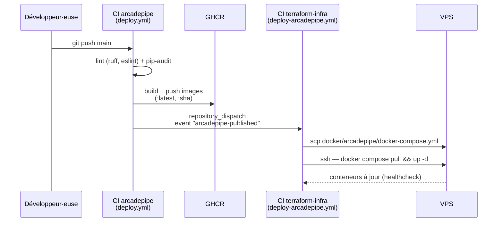

# Déploiement automatique d'ArcadePipe

Le code et le build d'ArcadePipe vivent dans [`pazpop/arcadepipe`](https://github.com/pazpop/arcadepipe), volontairement séparé de ce repo : celui du jeu ne connaît jamais l'IP du VPS ni Traefik, et celui-ci ne connaît jamais le code du jeu. Les deux CI se parlent par un seul événement GitHub (`repository_dispatch`), déclenché une fois les images publiées.



## Mise en place

1. **Workflow receveur** (`.github/workflows/deploy-arcadepipe.yml`, ce repo) : écoute `repository_dispatch: [arcadepipe-published]` et `workflow_dispatch` (redéploiement manuel : onglet *Actions*, *Deploy ArcadePipe*, *Run workflow*, utile pour un rollback).
2. **Workflow émetteur** (`deploy.yml`, repo `arcadepipe`) : build, push sur GHCR, puis notification via `peter-evans/repository-dispatch`, protégée par `if: github.repository == 'pazpop/arcadepipe'` (un fork build ses images sans tenter ce déclenchement).
3. **Secrets de ce repo** : `DEPLOY_HOST`, `DEPLOY_USER`, `DEPLOY_SSH_KEY`, et `DEPLOY_SSH_FINGERPRINT` (empreinte de la clé d'hôte ; sans elle, les actions SCP/SSH acceptent n'importe quelle clé, donc pas de protection MITM). **Point non intuitif** : ces actions négocient une clé **ECDSA** (bibliothèque SSH de Go), pas ED25519 comme OpenSSH. Prendre la ligne `(ECDSA)` de :
   ```sh
   ssh-keyscan -p 2222 <IP> | ssh-keygen -lf -
   ```
   À régénérer si le VPS est recréé : le workflow échoue sinon, volontairement.
4. **Secret du repo `arcadepipe`** : `TERRAFORM_INFRA_DISPATCH_TOKEN`, un [token *fine-grained*](https://github.com/settings/tokens?type=beta) limité à ce repo-ci, permission *Contents: Read and write* (minimum exigé par l'API `dispatches`).
